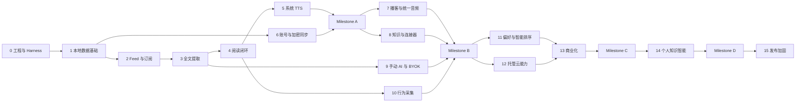

# River 开发与测试任务计划

| 字段 | 内容 |
|---|---|
| 依据 | `outputs/River-PRD.md` v1.1 Final |
| 计划版本 | 1.0 |
| 适用平台 | Android、iOS、Windows |
| 开发方式 | Flutter 模块化单体、本地优先、纵向功能切片 |
| 交付策略 | 主干开发、小 PR、Feature Flag、阶段门禁 |

本文是执行顺序，不是固定日历。单个任务应拆成约 1～3 个工程日的 Issue；超过 5 天仍无法独立验收的任务必须继续拆分。阶段只有在退出条件全部通过后才能进入下一个正式里程碑。

## 1. 总体路径

并行原则：只有依赖箭头已经满足的阶段才能并行。Android、iOS、Windows不是三个独立产品线；每个纵向功能由同一个任务负责三端契约，平台实现可以并行开发。

## 2. 每个任务的统一完成定义

所有任务在关闭前必须满足：

- 需求与失败行为明确，并关联 PRD FR 编号；
- 领域规则位于纯 Dart 包，外部 SDK 位于适配器；
- 单元/Widget/集成测试与风险等级匹配；
- 网络和 AI 测试使用 Fake 或 Replay，PR 测试不访问真实服务；
- 新解析问题包含最小 Fixture，新数据库版本包含迁移 Fixture；
- 日志、埋点、崩溃信息不包含正文、凭据或密钥；
- 具备加载、空、成功、失败、重试、离线和权限拒绝状态；
- `dart run tool/ci.dart fast` 通过；
- R2/R3 任务写明灰度、降级或回滚方式。

## 3. 阶段0：工程、三端 Runner 与 Harness 基线

目标：让任何功能提交都能够被自动构建和验证。

| 任务 | 实现内容 | 必须测试/证据 |
|---|---|---|
| FND-001 | 安装并锁定 Flutter stable、Dart 版本，执行 `tool/bootstrap.ps1`，提交 Android/iOS/Windows Runner | 三端 Debug 构建成功；记录 SDK 版本 |
| FND-002 | 建立依赖注入与 Composition Root；Clock、HTTP、ID、文件系统、AI和平台能力禁止全局获取 | 依赖方向测试；领域包不依赖 Flutter |
| FND-003 | 建立路由、主题、本地化、错误边界和 Feature Flag | Widget 测试覆盖亮/暗主题、中文、英文和错误页 |
| FND-004 | 固化 Fast/Merge/Nightly/Release CI，输出 JUnit/JSON/构建产物 | 故意制造失败，确认四类门禁会阻止错误合并 |
| FND-005 | 扩充 Harness CLI 报告格式、Case ID、基线差异和失败码 | CLI 自测；重复运行结果一致 |
| FND-006 | 建立隐私安全日志规范、Crash接口和性能Span接口，开发环境使用Fake | 日志快照中不存在正文、Token、Cookie和AI Key |

退出条件：三端Runner已经提交；Fast Lane在15分钟内通过；Windows/Android/iOS至少能够构建；Harness离线重复运行结果一致。

## 4. 阶段1：本地数据层与任务系统

关联：FR-SYNC-001、FR-EXT-003、PRD第9章。

| 任务 | 实现内容 | 必须测试/证据 |
|---|---|---|
| DATA-001 | 设计 Drift/SQLite v1 Schema：FeedSubscription、Folder、Article、ArticleContent、ReadingEvent、KnowledgeItem、AudioItem、Job等 | Schema评审；外键、唯一键和索引测试 |
| DATA-002 | 建立Repository接口和事务边界，UI不得直接读写Drift DAO | Fake Repository单测；依赖方向检查 |
| DATA-003 | 建立v0→v1迁移框架、备份、失败回滚和迁移Fixture约定 | 空库、填充库、中断迁移、重复迁移测试 |
| DATA-004 | 实现持久化后台任务队列：幂等键、状态机、退避、取消、恢复和死信 | 状态机测试；进程终止后恢复测试 |
| DATA-005 | 实现缓存预算、LRU清理、保留规则和磁盘不足处理 | 容量边界、正在播放/收藏内容不被误删 |
| DATA-006 | 实现无需账号的本地模式、设置与安全凭据存储端口 | 首次离线启动；删除本地数据；密钥不入普通数据库 |

退出条件：10,000篇合成文章可导入、分页和搜索；所有后台任务可在崩溃后恢复；迁移失败不会损坏原库。

## 5. 阶段2：Feed发现、订阅与刷新

关联：FR-SUB-001、FR-SUB-002、FR-SUB-004 P0。

| 任务 | 实现内容 | 必须测试/证据 |
|---|---|---|
| FEED-001 | 实现受限HTTP客户端：超时、重定向、压缩、编码、响应大小、ETag和Last-Modified | FakeHTTP契约；超时、重定向环、超大响应测试 |
| FEED-002 | 实现 RSS 2.0、Atom、RDF与JSON Feed解析及规范化模型 | 合成与合法公开样例；解析成功率≥99% |
| FEED-003 | 实现网站首页Feed声明、常见路径和Content-Type发现 | 多Feed选择、无Feed、错误类型和重复URL测试 |
| FEED-004 | 实现文件夹、暂停/恢复、删除、去重和规范化URL | Repository与Widget测试；重复操作幂等 |
| FEED-005 | 实现OPML导入导出并保留文件夹层级 | 往返一致性、非法XML、大文件和重复源测试 |
| FEED-006 | 实现前台增量刷新、条件请求、并发限制和刷新状态 | 同域名限流、304、部分失败、取消和重启恢复 |
| FEED-007 | 接入Android WorkManager、iOS BGTaskScheduler、Windows托盘/计划任务 | 三端平台契约测试；真实系统Smoke Test |
| FEED-008 | 构建订阅管理与添加来源UI | Widget测试覆盖粘贴、发现、选择、错误和离线 |

退出条件：同一OPML在三端导入得到一致订阅；刷新可增量恢复；Feed语料成功率达到门槛且无真实网络进入PR测试。

## 6. 阶段3：分层全文提取与微信适配

关联：FR-EXT-001～004。

| 任务 | 实现内容 | 必须测试/证据 |
|---|---|---|
| EXT-001 | 定义统一输入、规范化输出、失败码、Extractor版本和质量评分 | 契约测试；所有失败均能归类 |
| EXT-002 | 实现Feed全文判定与正文可信度判断 | 全文/摘要/截断Feed语料 |
| EXT-003 | 集成正式Readability实现，保留段落、图片、引用、表格和代码 | 中英长文、多栏、广告、代码和图片语料 |
| EXT-004 | 实现微信公众号适配器：`#js_content`、元数据、`data-src`、清理和回退 | 微信结构语料；正文/图片成功率≥95% |
| EXT-005 | 实现统一HTML Sanitizer、URL协议限制和资源代理策略 | XSS、iframe、事件属性、危险协议全部为0 |
| EXT-006 | 实现提取缓存、并发合并、内容哈希、ETag和规则版本重解析 | 同URL并发只执行一次；缓存失效与升级测试 |
| EXT-007 | 实现Android WebView、WKWebView、WebView2渲染回退端口 | 三端平台视图集成测试；超时和脚本隔离 |
| EXT-008 | 实现失败UX：使用Feed内容、打开原文、重试、报告问题 | Widget与Integration Test覆盖所有回退层 |
| EXT-009 | 建立低频Live Canary，只记录状态、耗时和结构，不归档全文 | Nightly报告；限流、隐私和版权检查 |

退出条件：静态正文计算P95<300ms；缓存正文P75<200ms；微信基准通过率≥95%；危险节点/属性为0。

## 7. 阶段4：文章列表、阅读页与离线闭环

关联：FR-READ-001、FR-READ-002、FR-KB-002 P0。

| 任务 | 实现内容 | 必须测试/证据 |
|---|---|---|
| READ-001 | 实现收件箱、未读、收藏、稍后读、文件夹和时间排序 | ViewModel单测；空/加载/错误/大列表Widget测试 |
| READ-002 | 实现渐进阅读页：Feed内容先显示，全文完成后无闪烁替换 | Integration Test验证滚动位置和选择状态不丢失 |
| READ-003 | 实现字体、字号、行距、页宽、主题和系统缩放 | Golden覆盖手机、平板、Windows窄/宽、深浅主题 |
| READ-004 | 实现已读状态、阅读进度、收藏、稍后读和分享 | 幂等状态测试；应用重启恢复 |
| READ-005 | 实现本地全文搜索、过滤和结果高亮 | 10,000篇P95<500ms；中文、英文和特殊字符测试 |
| READ-006 | 实现离线下载、网络恢复和失败任务重试 | 飞行模式端到端；冷启动读取缓存文章 |
| READ-007 | 完成键盘、焦点、屏幕阅读器、对比度和大字体可访问性 | Android TalkBack、iOS VoiceOver、Windows键盘检查 |

退出条件：用户可以无账号完成订阅→刷新→全文→离线→搜索；列表P75<500ms；三端核心状态一致。

## 8. 阶段5：系统TTS与后台音频

关联：FR-TTS-001～003。

| 任务 | 实现内容 | 必须测试/证据 |
|---|---|---|
| TTS-001 | 定义AudioEngine平台契约和文章分句规则 | 语言、标点、超长句、代码块和空内容单测 |
| TTS-002 | 接入Android TextToSpeech、iOS AVSpeechSynthesizer、Windows语音 | 原生单测+Dart契约+每端Integration Test |
| TTS-003 | 实现播放、暂停、跳句、倍速、音色、定时关闭和当前句高亮 | 状态机单测；重启后继续 |
| TTS-004 | 实现后台音频、通知/锁屏控制、耳机事件和音频焦点 | 真机锁屏、来电/其他音频中断、蓝牙测试 |
| TTS-005 | 实现长文章分段、预取、取消和错误回退 | 2小时合成长文；内存、取消和资源释放测试 |

退出条件：三端后台播放、暂停恢复、进度保存通过真实设备/系统验收；阅读和TTS进度一致。

## 9. 阶段6：账号与端到端加密同步

关联：FR-SYNC-002、FR-SYNC-003。

| 任务 | 实现内容 | 必须测试/证据 |
|---|---|---|
| SYNC-001 | 定义账户、设备、密钥、密文信封、游标、墓碑和同步协议 | 协议版本与威胁模型评审 |
| SYNC-002 | 实现注册/登录或无密码登录、设备加入与设备撤销 | 会话过期、离线、重复登录、被撤销设备测试 |
| SYNC-003 | 实现客户端加密、密钥恢复提示与安全存储 | 已知向量、密文不含明文、错误密钥和轮换测试 |
| SYNC-004 | 实现订阅、文件夹、状态、设置、进度和知识元数据增量同步 | 双设备状态机与属性测试 |
| SYNC-005 | 实现PRD冲突规则、去重、墓碑和幂等重放 | 乱序、重复、并发编辑、时钟相同和离线一周测试 |
| SYNC-006 | 实现同步状态、冲突历史、重试、退出账号和云数据删除 | Widget/端到端；本地数据不因退出丢失 |
| SYNC-007 | 建立服务端限流、审计、备份和密文不可读验证 | 服务端测试；管理员无法读取用户正文 |

Milestone A退出门槛：阶段0～6全部通过；三端用同一真实Feed完成订阅、刷新、全文、离线、TTS和可选同步；不得用云端不可用阻断本地阅读。

## 10. 阶段7：播客与统一播放队列

关联：FR-POD-001、FR-POD-002、FR-POD-003。

| 任务 | 实现内容 | 必须测试/证据 |
|---|---|---|
| POD-001 | 解析Podcast Feed、enclosure、封面、时长、显式标记和增量更新 | 常见/异常Feed、重复分集、变更URL测试 |
| POD-002 | 实现流式播放、下载、断点续传、倍速和节目级策略 | 网络切换、磁盘不足、损坏音频和重启恢复 |
| POD-003 | 文章TTS与Podcast统一为AudioItem和队列状态机 | 混排、去重、移动、删除、连续播放属性测试 |
| POD-004 | 支持Podcasting 2.0 Chapters与Transcript | 官方/缺失/非法章节和字幕语料 |
| POD-005 | 完成播放页、迷你播放器、队列和下载管理UI | Widget、Golden、三端后台Integration Test |

退出条件：文章与播客可在同一队列连续后台播放；下载与进度在重启和断网后正确恢复。

## 11. 阶段8：知识对象、高亮、Markdown与Notion

关联：FR-READ-003、FR-KB-001、FR-CON-001～003 P0。

| 任务 | 实现内容 | 必须测试/证据 |
|---|---|---|
| KB-001 | 实现高亮、笔记、DOM定位、文本锚点和正文重解析恢复 | 正文版本变化、重复文本和锚点丢失测试 |
| KB-002 | 实现统一KnowledgeItem、来源引用、内容哈希和外部映射 | Repository、迁移和去重测试 |
| KB-003 | 将文章、摘要、高亮和笔记确定性渲染为规范Markdown文档 | 字节稳定、Front Matter注入、换行和安全文件名测试 |
| KB-004 | 定义连接器Create/Update/Delete/Status协议和幂等任务队列 | Fake Connector契约；退避、死信和人工重试 |
| KB-005 | 实现单篇/批量Markdown文件导出和远程/本地图片策略 | 往返、文件名冲突、非法字符和大批量导出 |
| KB-006 | 实现Notion OAuth、目标选择、Page/Block映射和River ID | Sandbox契约；重复保存不生成副本 |
| KB-007 | 构建知识列表、详情、同步状态和失败恢复UI | Widget与端到端：文章→高亮→知识→Notion |

退出条件：同一文章重复保存只更新一个知识对象和一个Notion页面；连接器失败不影响本地数据。

## 12. 阶段9：手动AI摘要与BYOK

关联：FR-AI-001～004。

| 任务 | 实现内容 | 必须测试/证据 |
|---|---|---|
| AI-001 | 定义AI Provider、结构化Schema、Prompt注册表和版本规则 | Provider契约；Schema成功率100% |
| AI-002 | 实现OpenAI-compatible BYOK与预置Provider配置 | Fake/Replay；密钥安全存储与脱敏日志 |
| AI-003 | 实现长文分块、段落引用、合并去重和上下文预算 | 超长文、边界事实、跨块事实和中断恢复 |
| AI-004 | 实现正文哈希+模型+Prompt+语言缓存键和请求合并 | 缓存命中不调用Provider；并发只计一次 |
| AI-005 | 实现摘要UI：一句话、要点、阅读价值、主题和错误恢复 | Widget覆盖生成、取消、重试、过期摘要和离线 |
| AI-006 | 将黄金集扩充到中英、多类型和高风险事实样例 | 必要事实覆盖≥90%；禁用声明命中率0 |

退出条件：更换模型或Prompt必须输出质量、延迟、成本差异；任何AI失败不破坏正文阅读。

## 13. 阶段10：阅读行为采集

关联：FR-PREF-001。

| 任务 | 实现内容 | 必须测试/证据 |
|---|---|---|
| PREF-001 | 定义展示、打开、有效阅读、完成、收藏、知识和负反馈事件 | Schema/版本测试；重复事件幂等 |
| PREF-002 | 实现前后台、滚动深度和有效时长状态机，排除挂机 | FakeClock单测；切后台、分屏、锁屏和跳读测试 |
| PREF-003 | 实现本地事件存储、保留、清空、导出和隐私设置 | 本地默认；关闭后停止新增；删除彻底 |
| PREF-004 | 增加用户可读的行为说明和首次启用提示 | 可访问性与理解度走查；不得暗中上传 |

Milestone B退出门槛：阶段7～10全部通过；用户可从订阅、阅读、摘要、朗读一路保存到Notion；文章与播客统一播放；行为事件默认本地可控。

## 14. 阶段11：偏好模型与智能排序

关联：FR-PREF-002～004、FR-AI-005。

| 任务 | 实现内容 | 必须测试/证据 |
|---|---|---|
| RANK-001 | 实现信号权重、时间衰减、主题/来源画像和模型版本 | 模拟会话与属性测试；点击始终是弱信号 |
| RANK-002 | 实现语义、来源、主题、完成概率、时效和探索排序 | 固定候选集可重放；排序解释一致 |
| RANK-003 | 实现来源多样性、探索配额、负反馈和主题屏蔽 | 单一来源占比、茧房和恶意事件测试 |
| RANK-004 | 实现“为什么推荐”、查看/编辑/关闭/清空画像 | Widget与端到端；关闭后回到时间排序 |
| RANK-005 | 实现仅对高匹配文章自动摘要及Wi-Fi/日限额 | 额度、网络、取消、缓存和任务恢复测试 |
| RANK-006 | 建立时间排序对照实验和隐私安全聚合指标 | 完成率提升且来源多样性不显著下降 |

退出条件：离线评测全部满足不变量；受控实验中有效阅读完成率改善，快速退出率和来源多样性护栏不恶化。

## 15. 阶段12：托管AI、云TTS、转录与云端救援

关联：FR-TTS-004、FR-POD-003、FR-EXT-001第5层、FR-AI-003托管方式。

| 任务 | 实现内容 | 必须测试/证据 |
|---|---|---|
| CLOUD-001 | 实现模型路由、Provider密钥代理、限流、超时、熔断和质量回退 | Provider故障、超时、重复请求和降级演练 |
| CLOUD-002 | 实现云端全文救援解析与完整SSRF防护 | 私网、重定向、DNS变化、超大响应和恶意HTML |
| CLOUD-003 | 实现云TTS分段、缓存、清理和网络策略 | 计费时长、重复生成、取消、内容变化测试 |
| CLOUD-004 | 实现播客上传/拉取转录、章节和摘要任务 | 长音频、格式错误、中断恢复和隐私删除 |
| CLOUD-005 | 建立成本追踪、模型/能力级Span和远程Kill Switch | 成本异常演练；关闭云能力不影响基础阅读 |

退出条件：所有云任务具备幂等键、成本记录、取消和降级路径；服务故障时客户端仍可使用本地核心能力。

## 16. 阶段13：River Pro商业化

关联：FR-COM-001～008、FR-COM-002免费边界。

| 任务 | 实现内容 | 必须测试/证据 |
|---|---|---|
| COM-001 | 完成Free/Pro权益快照、签名、离线缓存和统一Gate | 权益矩阵；页面不得读取商品ID判断功能 |
| COM-002 | 实现能力级UsageGrant/UsageLedger、80/100%提醒和返还 | 重试、失败、取消、并发和重复通知不重复扣减 |
| COM-003 | 接入App Store、Google Play与Windows支付渠道 | Sandbox购买、续订、退款、撤销、宽限期和恢复购买 |
| COM-004 | 实现月付、年付、14天试用、创始会员和地区商品配置 | 价格、周期、自动续费和锁价展示准确 |
| COM-005 | 实现统一River Account订单映射和服务端交易事实源 | 多设备、账户合并、乱序Webhook和重复订单测试 |
| COM-006 | 实现价值时刻付费墙、频控、免费替代路径和A/B配置 | 首次启动/首篇全文绝不被阻断；曝光频控测试 |
| COM-007 | 实现取消、降级、导出、云数据保留期和账号删除分离 | 降级不删本地数据；周期结束和立即撤销测试 |
| COM-008 | 建立收入、退款、单位成本、毛利和异常用量看板 | 数据定义核对；日志中不存在私人内容 |
| COM-009 | 实现单用户成本上限、模型降级、熔断和人工补额度 | 重度用户、攻击、账单异常和客服恢复演练 |
| COM-010 | 建立Free权益永久回归集：微信全文、离线、系统TTS、播客、本地知识和完整导出 | 未登录、试用结束、Pro降级三种状态全部通过 |

Milestone C退出门槛：阶段11～13全部通过；三端购买、恢复、取消和降级一致；失败AI请求不扣额度；智能排序优于时间排序且单位经济护栏可观测。

> 2026-08-06 产品决策：真实支付渠道暂不接入。COM-003～005（商店、商品/交易事实源）后置，COM-006～009 不阻塞主体产品与阶段14开发；先完成 COM-010 的永久 Free 回归。恢复支付工作时仍按原测试矩阵执行，不得降低 Free 边界。

## 17. 阶段14：个人知识智能与高级连接器

关联：FR-KB-002 P1、FR-KB-003、FR-CON-003 P1、FR-CON-004、FR-CON-005、FR-POD-004。

| 任务 | 实现内容 | 必须测试/证据 |
|---|---|---|
| INTEL-001 | 实现Embedding版本、分块、重建和本地/云向量索引 | 模型升级、删除、重复和索引损坏恢复 |
| INTEL-002 | 实现语义搜索、相似文章和过滤器 | 黄金查询集的Recall/Precision基线 |
| INTEL-003 | 实现带段落引用的知识问答和证据不足拒答 | 引用可回到原文；无证据时不补全事实 |
| INTEL-004 | 实现Notion增量更新、Obsidian目录和WebDAV | Connector契约、冲突、限流和断网重试 |
| INTEL-005 | 实现IMA分享/文件导出/Deep Link；仅在公开API稳定后增加原生连接器 | 不使用私有接口；外部能力变化可降级 |
| INTEL-006 | 实现播客转录问答、每日音频简报和可选对谈式音频 | 事实引用、音频生成成本、取消和内容安全评测 |
| INTEL-007 | 实现FreshRSS、Miniflux账户适配及多账户来源映射 | 适配器契约、游标、重复源、状态同步和账号移除测试 |

> 2026-08-06：INTEL-001 已完成。当前实现以供应商无关端口隔离 Embedding 与索引存储，先交付内存/本地索引语义；云向量索引仅保留可替换端口，不绑定具体供应商。版本化分块、模型升级、内容变更、删除、并发幂等、失败原子性和损坏恢复均进入 Fast Lane。

> 2026-08-06：INTEL-002 已完成。语义搜索按知识条目聚合段落向量并返回原文偏移证据；相似文章复用已索引向量，来源类型/来源 ID/标签/主题/保存时间过滤在打分前执行，模型版本严格隔离。固定黄金集以 Recall@K 和 Precision@K 均不低于 0.90 作为 Fast Lane 硬门槛。

> 2026-08-06：INTEL-003 已完成。知识问答先经过语义检索分数门禁；无证据时不调用回答 Provider。每条回答陈述必须引用本次检索证据，未知、重复、缺失或越界引用失败关闭，并由客户端从可信检索结果物化原文、条目和精确偏移。固定 Replay 覆盖正常回答、检索拒答、Provider 主动拒答、伪造引用和无引用断言。

> 2026-08-06：INTEL-004 已完成。现有 Notion 内容哈希和外部映射继续承担增量更新；新增供应商无关的文档存储与 WebDAV Transport 端口。Obsidian 使用受限目录、原子写入、稳定文件路径和 revision 冲突保护；WebDAV 默认只允许 HTTPS，创建使用 `If-None-Match`，更新/删除使用 ETag `If-Match`。固定 Replay 覆盖幂等、冲突、条件写入、限流、断网重试和诊断隐私。

> 2026-08-06：INTEL-005 已完成。IMA 互操作只复用标准 Markdown/ZIP、系统分享、文件保存和固定公开 HTTPS 入口，不使用 Token、Cookie、私有 API 或未公开 Scheme。单条知识输出 Markdown，多条或带资源输出确定性 ZIP，包大小限制 200 MiB；分享取消、不可用和打开失败显式降级且不影响 River 本地知识。固定 Replay 覆盖单/多文件、取消、公开入口和私有 URI 拒绝。

Milestone D退出门槛：知识问答必须显示可验证引用；连接器故障不影响内部知识对象；AI音频成本和质量达到上线门槛。

## 18. 阶段15：正式发布加固

关联：PRD第11、15、16章。

| 任务 | 实现内容 | 必须测试/证据 |
|---|---|---|
| REL-001 | 冻结RC范围，清理Feature Flag和调试入口 | 发布配置审查；未完成功能默认关闭 |
| REL-002 | 执行Android/iOS真机矩阵与Windows干净虚拟机测试 | 安装、升级、卸载、权限、后台和离线报告 |
| REL-003 | 从N-1/N-2版本执行数据库、同步协议和缓存升级 | 每个历史Fixture升级；失败可恢复或导出 |
| REL-004 | 压测10,000篇文章、长音频、低内存、弱网和磁盘不足 | 性能报告达到PRD P75/P95目标 |
| REL-005 | 完成安全审计：HTML、SSRF、OAuth、密钥、支付、密文和依赖 | 威胁模型、扫描报告和修复记录 |
| REL-006 | 完成隐私政策、内容处理说明、商店资料和账号删除流程 | 法务/商店检查；真实删除演练 |
| REL-007 | 保存混淆符号、SBOM、签名材料流程和可复现构建信息 | 崩溃堆栈可还原；签名密钥不进仓库 |
| REL-008 | 建立内部→1%→10%→100%灰度、监控和回滚Runbook | Kill Switch、回滚、旧客户端兼容演练 |
| REL-009 | 按PRD第16章逐条签署18项正式验收 | 产品、工程、测试、安全共同确认 |

正式发布条件：PRD第16章18项验收全部通过；Crash-free Sessions≥99.5%；无P0/P1已知缺陷；解析、AI、同步、支付和升级均有可执行回滚方案。

## 19. 测试执行矩阵

| 变更类型 | PR Fast | Merge | Nightly | Release |
|---|---|---|---|---|
| 纯领域规则 | 单元+属性测试 | 全量回归 | Fuzz | RC全量 |
| Feed/全文 | Fixture语料 | 扩展语料 | Live Canary | 真实站点抽样 |
| UI/ViewModel | 单元+Widget | Golden | 多尺寸/无障碍 | 真机旅程 |
| 数据库/同步 | Repository单测 | 迁移+双端模拟 | 冲突Fuzz | N-2升级 |
| AI/排序 | Replay+Schema | 黄金集差异 | 真实模型、成本 | 人工抽检 |
| 平台通道 | Dart契约 | 当前平台集成 | 三端构建 | 真机/系统测试 |
| 支付/权益 | Fake商店+幂等 | Sandbox | 乱序Webhook | 真实小额订单 |

## 20. 首批端到端旅程

以下旅程建立后不得删除，只能扩展：

1. 无账号启动→导入OPML→刷新→打开微信全文→断网重启继续阅读；
2. 文章→系统TTS→锁屏暂停→耳机恢复→保存播放进度；
3. 播客下载→与文章TTS混排→连续后台播放；
4. 文章→高亮→手动AI摘要→保存知识→Notion幂等更新；
5. 手机阅读一半→Windows继续→双端离线修改→冲突合并；
6. Pro试用→生成摘要→失败返还额度→恢复购买→取消后安全降级；
7. 数据库N-2升级→任务中断→重启恢复→完整导出；
8. 关闭偏好学习→清空画像→排序恢复时间顺序且停止新增事件。

## 21. 需求覆盖索引

| PRD范围 | 主要阶段 |
|---|---|
| FR-SUB-001～004 | 阶段2；P1多账户放入Milestone D后的扩展Backlog |
| FR-EXT-001～004 | 阶段3、12 |
| FR-READ-001～003 | 阶段4、8 |
| FR-AI-001～005 | 阶段9、11、12 |
| FR-PREF-001～004 | 阶段10、11 |
| FR-TTS-001～004 | 阶段5、12 |
| FR-POD-001～004 | 阶段7、12、14 |
| FR-KB-001～003 | 阶段8、14 |
| FR-CON-001～005 | 阶段8、14 |
| FR-SYNC-001～003 | 阶段1、6 |
| FR-COM-001～008 | 阶段13 |

## 22. 开工顺序

当前下一批任务固定为：

1. FND-001：安装SDK并生成三端Runner；
2. FND-002：完成Composition Root与端口注入；
3. FND-004：使Fast Lane在真实SDK下通过；
4. DATA-001：评审SQLite v1 Schema；
5. DATA-003：在写业务前建立第一份迁移Fixture；
6. DATA-004：实现持久化任务队列；
7. FEED-001/002：从FakeHTTP与固定Feed语料开始构建第一个纵向切片。

在上述任务完成前，不开始真实AI Provider、Notion OAuth、推荐模型或支付接入。
